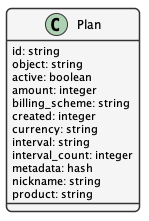
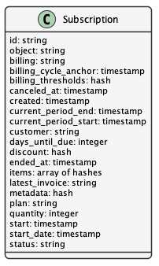

Membership Plan Management
==========================

.. contents:: Table of Contents
    :depth: 2

Overview
--------

To support ongoing operations, DataONE offers paid services for memberships. This document outlines the design and implementation details needed to offer these services. It describes the Plans, Subscriptions, Products, Customers, Quotas and Orders that DataONE needs to track in order to know who has subscribed to Membership Plans, what Products the Plans include, what additional Products they add into their Order, and what Quota limits are set per Product. The details of how the payment will be collected is to be determined, but will involve the UCSB extramural funds payment service.

..
    @startuml images/overview.png
    !include ./plantuml-styles.txt
    'left to right direction
    class Plan {
    }
    class Product {
    }
    class Subscription {
    }
    class Customer {
    }
    class Order {
    }
    class Quota {
    }
    
    Subscription "1" --o "1" Product : "associated with"
    Plan "1" o-right- "1" Subscription : "contains"
    Customer "1" -right-o "1" Subscription : "associated with"
    Customer "1" --o "n" Order : "associated with"
    Order "0" -right-o "n" Product : "contains"
    Product "0"--o "n" Quota : "contains"
    
    @enduml
    
.. image:: images/overview.png

Plans
-----
A DataONE Plan defines a price, currency, and billing cycle for a given subscription service product.  There are initially four named subscription plans offered:

- Individual
- Organization
- Institution
- Institution+

A Plan is based on a particular Product, identified by the product ID.  The associated Product may change over time in order to add features to the Plan, like increasing the custom portal count, etc.  Arbitrary key-value pair fields can be added to the ``metadata`` field to keep track of internal Plan metadata.  Multiple Plans may be associated with a given Product so you can offer them in different currencies.  The list of active Plans are publicly accessible for clients like MetacatUI or the DataONE website to render.

..
    @startuml images/plan.png
    !include ./plantuml-styles.txt

    class Plan {
        id: string
        object: string
        active: boolean
        amount: integer
        billing_scheme: string
        created: integer
        currency: string
        interval: string
        interval_count: integer
        metadata: hash
        nickname: string
        product: string
        }
    @enduml

To support ongoing operations, DataONE offers paid services for memberships.  This document outlines the design and implementation details needed to offer these services.  It describes the Plans, Subscriptions, Products, Customers, Quotas and Orders that DataONE needs to track in order to know who has subscribed to Membership Plans, what Products the Plans include, what additional Products they add into their Order, and what Quota limits are set per Product.  The details of how the payment will be collected is to be determined, but will involve the UCSB extramural funds payment service.

The following diagram gives an overview of the relationships among the types of information stored:

An example Plan:

.. code:: json

    {
        "id": "445A35DC-A14D-4D89-8B4F-61118D9B3BEA",
        "object": "plan",
        "active": true,
        "amount": 300000,
        "billing_scheme": "send_invoice", 
        "created": 1559768309,
        "currency": "USD",
        "interval": "year",
        "interval_count": 1,
        "metadata": {},
        "nickname": "Organization",
        "product": "725C2F79-7E0B-4018-94F3-C16D05F23CCC"
    }

Subscriptions
-------------

Subscriptions are products that are billed on a recurring basis, and associate a Customer with a particular Plan, or a list of Plans.  Subscriptions have creation, start, end and cancel dates used to keep track of the status of the Subscription.  The status field changes based on timely payment of the latest Invoice associated with the Subscription.  Individual Subscriptions can be accessed by the Customer or by an administrator.

..
    @startuml images/subscription.png
    !include ./plantuml-styles.txt

    class Subscription {
        id: string
        object: string
        billing: string
        billing_cycle_anchor: timestamp
        billing_thresholds: hash
        canceled_at: timestamp
        created: timestamp
        current_period_end: timestamp
        current_period_start: timestamp
        customer: string
        days_until_due: integer
        discount: hash
        ended_at: timestamp
        items: array of hashes
        latest_invoice: string
        metadata: hash
        plan: string
        quantity: integer
        start: timestamp
        start_date: timestamp
        status: string
        }
    @enduml

Products
--------

Products define the exact DataONE service (or goods) offered, and describe the features of the service using the extensible ``metadata`` field.  Each Product is unique, and can be tied to multiple pricing Plans.

..
    @startuml images/product.png
    !include ./plantuml-styles.txt

    class Product {
        id: string
        object: string
        active: boolean
        name: string
        caption: string
        description: string
        created: timestamp
        statement_descriptor: string
        type: string
        unit_label: string
        url: string
        metadata: hash
    }
    @enduml

.. image:: images/product.png

An example Product:

.. code:: json

    {
        "id": "725C2F79-7E0B-4018-94F3-C16D05F23CCC",
        "object": "product",
        "active": true,
        "name": "Organization",
        "caption": "Small institutions or groups",
        "description": "Create multiple portals for your work and projects. Help others understand and access your data.",
        "created": 1559768309,
        "statement_descriptor": "DataONE Membership Plan - Organization",
        "type": "service",
        "unit_label": "membership",
        "url": "https://dataone.org/memberships/organization",
        "metadata": {
            "features": [
                {
                    "name": "custom_portal",
                    "label": "Branded Portals",
                    "description": "Showcase your research, data, results, and usage metrics by building a custom web portal.",
                    "count": 3
                },
                {
                    "name": "custom_search_filters",
                    "label": "Custom Search Filters",
                    "description": "Create custom search filters in your portal to allow scientists to search your holdings using filters appropriate to your field of science."
                },
                {
                    "name": "fair_data_assessment",
                    "label": "FAIR Data Assessments",
                    "description": "Access quality metric reports using the FAIR data suite of checks."
                },
                {
                    "name": "custom_quality_service",
                    "label": "Custom Quality Metrics",
                    "description": "Create a suite of custom quality metadata checks specific to your datasets."
                },
                {
                    "name": "aggregated_metrics",
                    "label": "Aggregated Metrics",
                    "description": "Access and share reports on aggregated usage metrics such as dataset views, data downloads, and dataset citations."
                },
                {
                    "name": "dataone_voting_member",
                    "label": "Custom Quality Metrics",
                    "description": "Vote on the direction and priorities at DataONE Community meetings."
                }
            ]
        }
    }

Customers
---------

Quotas
------

Orders
------
