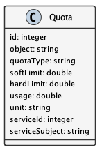
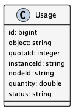
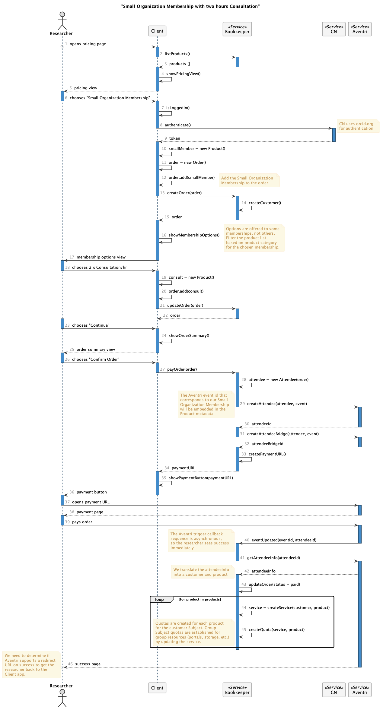

Membership Plan Management
==========================

.. contents:: Table of Contents
    :depth: 2

Overview
--------

To support ongoing operations, DataONE offers paid services for memberships alongside free services. This document outlines the design and implementation details needed to offer and manage these services. It describes the ``Products``, ``Customers``, ``Subscriptions``, ``Quotas``, ``Usages``, and ``Orders`` that DataONE needs to track. This documents:

- What service ``Products`` are available for purchase
- What ``Products`` a ``Customer`` purchased in an ``Order``
- What ``Subscriptions`` are established for a ``Customer`` for a ``Product``
- What ``Quota`` limits are set for ``Customers`` per ``Subscription``.
- What ``Usages`` are associated with a given ``Quota``

The following diagram shows the membership and payment records stored by DataONE and their relationships.

..
    @startuml images/overview.png
    !include ./plantuml-styles.txt
    class Product {
    }
    class Feature {
    }
    class Customer {
    }
    class Subscription {
    }
    class Order {
    }
    class Quota {
    }
    class Usage {
    }
    

    Customer "1" --o "n" Order : "          "
    Order "0" -right-o "n" Product : "          "
    Customer "0" -right-o "n" Subscription : "          "
    Subscription "1" -up-o "n" Product : "          "
    Subscription "1" -right-o "n" Quota : "          "
    Quota "1" -right-o "n" Usage : "          "
    Product "0" -right-o "n" Feature : "          "
    Feature "0" -down-o "1" Quota : "          "
    @enduml
    
.. image:: images/overview.png

Products
--------

``Products`` define the exact DataONE service offered, and describe the features of the service using the extensible ``metadata`` field.  Each ``Product`` is unique and may be part of any ``Order``, such as training or consultation ``Products``.  DataONE keeps a catalog of ``Products`` offered over time which may be listed by client applications.

Product REST endpoints:

.. code::
    
    listProducts():  GET    /products
    createProduct(): POST   /products
    getProduct():    GET    /products/:id
    getProduct():    GET    /products?name=:name
    getProduct():    GET    /products?description=:description
    updateProduct(): PUT    /products/:id
    deleteProduct(): DELETE /products/:id

..
    @startuml images/product.png
    !include ./plantuml-styles.txt

    class Product {
        id: string
        object: string
        active: boolean
        amount: integer
        name: string
        caption: string
        currency: string
        created: timestamp
        description: string
        interval: string
        statementDescriptor: string
        type: string
        unitLabel: string
        url: string
        metadata: hash
    }
    @enduml

.. image:: images/product.png

An example ``Product``:

.. code:: json

    {
        "id": "725C2F79-7E0B-4018-94F3-C16D05F23CCC",
        "object": "product",
        "active": true,
        "name": "Organization",
        "caption": "Small institutions or groups",
        "description": "Create multiple portals for your work and projects. Help others understand and access your data.",
        "created": 1559768309,
        "statementDescriptor": "DataONE Membership Plan - Organization",
        "type": "service",
        "unitLabel": "membership",
        "url": "https://dataone.org/memberships/organization",
        "metadata": {
            "features": [
                {
                    "name": "branded_portal",
                    "label": "Branded Portals",
                    "description": "Showcase your research, data, results, and usage metrics by building a custom web portal.",
                    "quota": {
                        "id": 5,
                        "object": "quota",
                        "name": "branded_portal_count",
                        "softLimit": "3",
                        "hardLimit": "3",
                        "unit": "portal"
                    }
                },
                {
                    "name": "custom_search_filters",
                    "label": "Custom Search Filters",
                    "description": "Create custom search filters in your portal to allow scientists to search your holdings using filters appropriate to your field of science."
                },
                {
                    "name": "fair_data_assessment",
                    "label": "FAIR Data Assessments",
                    "description": "Access quality metric reports using the FAIR data suite of checks."
                },
                {
                    "name": "custom_quality_service",
                    "label": "Custom Quality Metrics",
                    "description": "Create a suite of custom quality metadata checks specific to your datasets."
                },
                {
                    "name": "aggregated_metrics",
                    "label": "Aggregated Metrics",
                    "description": "Access and share reports on aggregated usage metrics such as dataset views, data downloads, and dataset citations."
                },
                {
                    "name": "dataone_voting_member",
                    "label": "DataONE Voting Member",
                    "description": "Vote on the direction and priorities at DataONE Community meetings."
                }
            ]
        }
    }

Customers
---------

``Customers`` are identified by a DataONE account (by ORCID identifier), and are associated with ``Orders`` that they make for free or purchased ``Products``.  When an ``Order`` is completed, the ``Customer`` is associated with a ``Subscription`` which links the ordered ``Product`` to the ``Customer`` and the associated ``Quota`` limits.
 
Customer REST endpoints:

.. code::
    
    listCustomers():  GET    /customers
    createCustomer(): POST   /customers
    getCustomer():    GET    /customers/:id
    getCustomer():    GET    /customers?subject=:subject
    getCustomer():    GET    /customers?email=:email
    updateCustomer(): PUT    /customers/:id
    deleteCustomer(): DELETE /customers/:id

..
    @startuml images/customer.png
    !include ./plantuml-styles.txt

    class Customer {
        id: string
        object: string
        balance: integer
        address: hash
        created: timestamp
        currency: string
        delinquent: boolean
        description: string
        discount: hash
        email: string
        invoicePrefix: string
        invoiceSettings: hash
        metadata: hashes
        givenName: string
        surName: string
        phone: string
        subject: string
    }
    @enduml

.. image:: images/customer.png

An example ``Customer``:

.. code:: json
    
    {
        "id": 1,
        "object": "customer",
        "subject": "http://orcid.org/0000-0002-8121-2341",
        "balance": 0,
        "address": {
            "line1": "735 State Street",
            "line2": "Suite 300",
            "city": "Santa Barbara",
            "state": "CA",
            "postalCode": "93106",
            "country": "USA"
        },
        "created": 1562866734,
        "currency": "USD",
        "delinquent": false,
        "description": "",
        "discount": {},
        "email": "cjones@nceas.ucsb.edu",
        "invoicePrefix": "",
        "invoiceSettings": {},
        "metadata": {},
        "givenName": "Christopher",
        "surName": "Jones",
        "phone": "805-893-2500"
    }
    
Subscriptions
-------------

``Subscriptions`` represent a ``Product`` that has been ordered by a ``Customer`` and is paid for on a recurring basis.  A ``Subscription`` records the creation and cancelation dates, and can  an optional ``Discount``.  They may also be the ``Quota`` defined in the subscribed  ``Product``, along with the ``Usage`` of the limited resource. 

Subscription REST endoints:

.. code::
    
    listSubscriptions():  GET    /subscriptions
    listSubscriptions():  GET    /subscriptions?customerId=:customerId
    listSubscriptions():  GET    /subscriptions?subject=:subject
    createSubscription(): POST   /subscriptions
    getSubscription():    GET    /subscriptions/:id
    updateSubscription(): PUT    /subscriptions/:id
    cancelSubscription(): DELETE /subscriptions/:id

..
    @startuml images/subscription.png
    !include ./plantuml-styles.txt

    class Subscription {
        id: string
        object: string
        'billingCycleAnchor: timestamp
        canceledAt: timestamp
        collectionMethod: string
        created: timestamp
        'currentPeriodEnd: timestamp
        'currentPeriodStart: timestamp
        customerId: integer
        'daysUntilDue: integer
        'discount: hash
        'endedAt: timestamp
        'items: list # use this later if needed
        'latestInvoice: integer
        metadata: hash
        productId: integer
        quantity: integer
        'start: timestamp
        startDate: timestamp
        status: string
        trialEnd: timestamp
        trialStart: timestamp
    }
    @enduml

.. image:: images/subscription.png

An example ``Subscription``:

.. code:: json
    
    {
        "id": 10,
        "object": "subscription",
        "canceledAt": null,
        "collectionMethod": "send_invoice",
        "created": 1568066038,
        "customerId": 20,
        "metadata": {},
        "productId": 2,
        "quantity": 1,
        "startDate": 1568066038,
        "status": "unpaid",
        "trialEnd": null,
        "trialStart": null
    }

Quotas
------

``Quotas`` are limits set for a particular ``Product``, such as the number of portals allowed, disk space allowed, etc. ``Quotas`` have a soft and hard limit per unit to help with communicating limit warnings.  ``Quotas`` that don't have an associated ``Subject`` are considered general product quotas used for informational display (part of a Product's ``Feature`` list).

``Quotas`` stored for individual ``Subject`` identifiers also include a ``usage`` field that is periodically updated to reflect the ``Subject``'s current usage of the resource, harvested from the Coordinating Node indices.

    Note: The usage harvest schedule is to be determined, but calculating usage once per hour or once per day may be appropriate.

``Quotas`` are established through ``Subscriptions``, where a ``Customer`` subscribes to ``Products``. Multiple ``Quotas`` can be associated with a given ``Subscription``.

Quota REST endpoints:

.. code::
    
    QuotaList = listQuotas():   GET    /quotas
    QuotaList = listQuotas():   GET    /quotas?subscriptionId=:subscriptionId
    QuotaList = listQuotas():   GET    /quotas?subject=:subject
    Quota     = createQuota():  POST   /quotas
    Quota     = getQuota():     GET    /quotas/:id
    Quota     = updateQuota():  PUT    /quotas/:id
    boolean   = deleteQuota():  DELETE /quotas/:id
    UsageList = listUsages():   GET    /quotas/:name/usage?subject=:subject
    boolean   = isActive():     GET    /quotas/:name/usage?instanceId=:instanceId
    Quota     = hasRemaining(): GET    /quotas/:name/usage/remaining?\              
                                            subject=:subject&\
                                            submitterSubject=:submitterSubject&\
                                            requestedUsage=:requestedUsage
..
    @startuml images/quota.png
    !include ./plantuml-styles.txt

    class Quota {
        id: string
        object: string
        name: string
        softLimit: integer
        hardLimit: integer
        usage: integer
        unit: string
        subscriptionId: integer
        subject: string
    }
    @enduml

Authorizing resource usage
~~~~~~~~~~~~~~~~~~~~~~~~~~
    
Authorization of resource usage across Member Nodes involves a call to the quota service to determine the soft limit, hard limit, and usage, and throwing an ``InsufficentResources`` exception when the usage is at or over the hard limit.  For storage quotas, hard limits might be set to 10% greater than the soft limit, whereas for portal limits, the soft and hard limits might be equal.  These settings can be individually customized as well. Client applications may also check quota limits for a given ``Subject`` before attempting to call an ``MNStorage`` API method (i.e. ``create()`` or ``update``).
    
Managing Shared Quotas
~~~~~~~~~~~~~~~~~~~~~~

``Quotas`` are established when a ``Customer`` enrolls for free or paid services.  ``Customers`` are their ``Subject`` identifier (e.g. their ORCID identifier), and quotas are set against this identifier.  When objects are uploaded to DataONE Member Nodes, the ``SystemMetadata.submitter`` field is used to check for quota limits.

In the case of shared quotas where a resource (like storage) is to be applied to a group of users,
client applications should set the appropriate `HTTP extension header field`_ during a call to the ``MNStorage`` methods of ``create()`` and ``update``. The DataONE custom HTTP extension headers include:

- ``X-DataONE-Storage-Subject``: The ``Subject`` used to determine shared archive storage quotas.
- ``X-DataONE-Portal-Subject``: The ``Subject`` used to determine shared branded portal quotas.
- ``X-DataONE-Replication-Subject``: The ``Subject`` used to determine shared replication quotas.

The value of the above extension header for each object should be set to the DataONE group identifier of the shared quota (e.g. ``CN=budden-lab,DC=dataone,DC=org``).  Typically, all calls to ``create()`` or ``update()`` should include the ``X-DataONE-Storage-Subject`` unless applying the storage to  the ``submitter`` ``Subject's`` quota is desired.  When uploading portal documents (i.e. with an ``https://purl.dataone.org/portals-1.0.0`` format identifier), the ``X-DataONE-Portal-Subject`` should also be included.

.. _`HTTP extension header field`: https://tools.ietf.org/html/rfc2616#section-4.2

An example 4TB ``Quota`` with a 90% soft limit:

.. code:: json
    
    {
        "id": 1,
        "object":"quota",
        "name":"archive_storage",
        "softLimit": 3774873,
        "hardLimit": 4194304,
        "unit": "megabyte",
        "customerId": 2,
        "subject": "CN=budden-lab,DC=dataone,DC=org"
    }

Usages
------

``Usages`` track which items use a portion of a ``Quota``.  For instance, for a ``portal_count`` quota, the object identifier of the portal document would be recorded as the instance of a portal that uses a portion of the total quota.  A ``Usage`` object is associated with one ``Quota``.

..
    @startuml images/usage.png
    !include ./plantuml-styles.txt

    class Usage {
        id: integer
        object: string
        quotaId: integer
        subject: string
        instanceId: integer
        quantity: integer
    }
    @enduml

Orders
------

``Orders`` track ``Customer`` purchases of a list of ``Products``, and the total amount of the ``Order`` that was charged in a ``Charge``.  Orders may be associated with an ``Invoice`` reminder for payment.  

Order REST endpoints:

.. code::
    
    listOrders():  GET    /orders
    createOrder(): POST   /orders
    getOrder():    GET    /orders/:id
    getOrder():    GET    /orders?subject=:subject
    getOrder():    GET    /orders?customerId=:customerId
    updateOrder(): PUT    /orders/:id
    payOrder():    PUT    /orders/:id/pay
    deleteOrder(): DELETE /orders/:id

..
    @startuml images/order.png
    !include ./plantuml-styles.txt

    class Order {
        id: integer
        object: string
        amount: integer
        amountReturned: integer
        charge: string
        created: timestamp
        currency: string
        customer: string
        email: string
        items: array of hashes
        metadata: hash
        status: string
        statusTransitions: hash
        updated: timestamp
    }
    @enduml

.. image:: images/order.png

An example Order:

.. code:: json
    
    {
        "id": 1,
        "object": "order",
        "amount": 50000,
        "amountReturned": 0,
        "charge": {
            "id": 3,
            "object": "charge",
            "amount": 50000,
            "amountRefunded": 0,
            "created": 1559768309,
            "currency": "USD",
            "customer": 2,
            "description": "DataONE Order # 1",
            "invoice": 4,
            "metadata": {},
            "order": 1,
            "paid": true,
            "statementDescriptor": "DataONE Order # 1",
            "status": "succeeded"
        },
        "created": 1559768309,
        "currency": "USD",
        "customer": 2,
        "email": "cjones@nceas.ucsb.edu",
        "items": [
            {
            "object": "order_item",
            "amount": 50000,
            "currency": "USD",
            "description": "DataONE Individual Membership",
            "parent": 1000,
            "quantity": 1,
            "type": "sku"
            }
        ],
        "metadata": {},
        "status": "paid",
        "statusTransitions": {
            "created": 1559768309,
            "paid": 1559768309
        },
        "updated": 1559768309
    }

Creating an Order
~~~~~~~~~~~~~~~~~

The following sequence diagram outlines the steps needed for a client to create an order:

..
    @startuml images/create-order.png
    !include ./plantuml-styles.txt
    
    autonumber ""
    title "Small Organization Membership with two hours Consultation"
    actor Researcher
    participant Client
    participant Bookkeeper <<Service>>
    participant "CN" <<Service>>
    participant Aventri <<Service>>
    
    Researcher o-> Client : opens pricing page
    
    activate Client
        Client -> Bookkeeper : listProducts()
    deactivate Client
    
    activate Bookkeeper
        Bookkeeper --> Client : products []
    deactivate Bookkeeper
    
    activate Client
        Client -> Client : showPricingView()
        Client --> Researcher : pricing view
    deactivate Client

    activate Researcher
        Researcher -> Client : chooses "Small Organization Membership"
    deactivate Researcher
    
    activate Client
        Client -> Client : isLoggedIn()
        Client -> CN : authenticate()
    deactivate Client
    
    activate CN
        note right
            CN uses orcid.org 
            for authentication
        end note
        CN --> Client : token
    deactivate CN
    
    activate Client
        Client -> Client : smallMember = new Product()
        Client -> Client : order = new Order()
        Client -> Client : order.add(smallMember)
        note right
            Add the Small Organization 
            Membership to the order
        end note
        Client -> Bookkeeper : createOrder(order)
    deactivate Client

    activate Bookkeeper
        Bookkeeper -> Bookkeeper : createCustomer()
        Bookkeeper --> Client : order
    deactivate Bookkeeper

    activate Client
        Client -> Client : showMembershipOptions()
        note right
            Options are offered to some
            memberships, not others.
            Filter the product list 
            based on product category
            for the chosen membership.
        end note
        Client -> Researcher : membership options view
    deactivate Client
    
    activate Researcher
        Researcher -> Client : chooses 2 x Consultation/hr
    deactivate Researcher
    
    activate Client
        Client -> Client : consult = new Product()
        Client -> Client : order.add(consult)
        Client -> Bookkeeper : updateOrder(order)
    deactivate Client
    
    activate Bookkeeper
        Bookkeeper --> Client : order
    deactivate Bookkeeper

    activate Researcher
        Researcher -> Client : chooses "Continue"
    deactivate Researcher

    activate Client
        Client -> Client : showOrderSummary()
        Client --> Researcher : order summary view
    deactivate Client
    
    activate Researcher
        Researcher -> Client : chooses "Confirm Order"
    deactivate Researcher

    activate Client
        Client -> Bookkeeper : payOrder(order)
    deactivate Client
    
    activate Bookkeeper
        Bookkeeper -> Bookkeeper : attendee = new Attendee(order)
        Bookkeeper -> Aventri : createAttendee(attendee, event)
        note left
            The Aventri event id that
            corresponds to our Small
            Organization Membership
            will be embedded in the 
            Product metadata
        end note
    deactivate Bookkeeper
    
    activate Aventri
        Aventri --> Bookkeeper : attendeeId
    deactivate Aventri
    
    activate Bookkeeper
        Bookkeeper -> Aventri : createAttendeeBridge(attendee, event)
    deactivate Bookkeeper
    
    activate Aventri
        Aventri --> Bookkeeper : attendeeBridgeId
    deactivate Aventri

    activate Bookkeeper
        Bookkeeper -> Bookkeeper : createPaymentURL()
        Bookkeeper --> Client : paymentURL
    deactivate Bookkeeper
    
    activate Client
        Client -> Client : showPaymentButton(paymentURL)
        Client --> Researcher : payment button
    deactivate Client
    
    activate Researcher
        Researcher -> Aventri : opens payment URL
    deactivate Researcher
    
    activate Aventri
        Aventri --> Researcher : payment page
    deactivate Aventri

    activate Researcher
        Researcher -> Aventri : pays order
    deactivate Researcher

    activate Aventri
        Aventri -> Bookkeeper : eventUpdated(eventId, attendeeId)
        note left
            The Aventri trigger callback 
            sequence is asynchronous,
            so the researcher sees success
            immediately
        end note
    deactivate Aventri

    activate Bookkeeper
        Bookkeeper -> Aventri : getAttendeeInfo(attendeeId)
    deactivate Bookkeeper
    
    activate Aventri
        Aventri --> Bookkeeper : attendeeInfo
        note left
            We translate the attendeeInfo
            into a customer and product
        end note
    
        activate Bookkeeper
            Bookkeeper -> Bookkeeper : updateOrder(status = paid)
            loop for product in products
                Bookkeeper -> Bookkeeper : subscription = subscribe(customer, product)
                Bookkeeper -> Bookkeeper : createQuota(subscription, product)
                note left
                    Quotas are created for each product
                    for the customer Subject. Group
                    Subject quotas are established for
                    group resources (portals, storage, etc.)
                    by updating the subscription.
                end note
            end
        deactivate Bookkeeper
    
        Aventri -->o Researcher : success page
        note left
            We need to determine if
            Aventri supports a redirect
            URL on success to get the 
            researcher back to the
            Client app.
        end note
    deactivate Aventri

    @enduml
    
    

    
Charges
-------

``Charges`` document transactions against a given payment source, like a credit card.  While DataONE won't track payment sources, we will track ``Charge`` events by ID as part of an ``Order``.

..
    @startuml images/charge.png
    !include ./plantuml-styles.txt

    class Charge {
        id: string
        object: string
        amount: integer
        amountRefunded: integer
        created: timestamp
        currency: string
        customer: string
        description: string
        failureCode: string
        invoice: string
        metadata: hash
        order: string
        outcome: string
        paid: boolean
        receiptEmail: string
        refunded: boolean
        refunds: list
        status: string
    }
    @enduml

.. image:: images/charge.png

An example Charge:

.. code:: json
    
    {
        "id": 3,
        "object": "charge",
        "amount": 50000,
        "amountRefunded": 0,
        "created": 1559768309,
        "currency": "USD",
        "customer": 2,
        "description": "DataONE Order # 1",
        "invoice": 4,
        "metadata": {},
        "order": 1,
        "paid": true,
        "statementDescriptor": "DataONE Order # 1",
        "status": "succeeded"
    }

Payments
--------

Details of how payments will be collected is to be determined, but will involve the UCSB Aventri events service. This service provides an API to create ``Events`` and ``Attendees`` which will be translated to ``Products`` and ``Customers``.  The API allows for REST-based callbacks, so when a user pays for an ``Event``, a registered callback will be called to inform the DataONE system of the purchase.  The DataONE system can then make a secondary call to get the details on the ``Attendee's`` payment.

    Note: While the Aventri system is not a one-to-one match for managing product payments, it looks to be flexible enough to map concepts, but needs further discussion.

Personally identifiable information that is stored in the DataONE system will be limited to, for instance, names, emails, and billing addresses, and will exclude financial transaction details (credit cards, etc.) other than the outcome of a ``Charge`` transaction.
