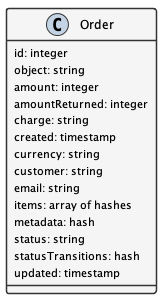

Membership Plan Management
==========================

.. contents:: Table of Contents
    :depth: 2

Overview
--------

To support ongoing operations, DataONE offers paid services for memberships. This document outlines the design and implementation details needed to offer these services. It describes the Products, Customers, Orders, Invoices, Charges, and Quotas that DataONE needs to track. This documents:

- What service Products are available for purchase
- What Products a Customer purchased in an Order
- What Invoices have been sent for an Order
- Which payment Charge(s) completed the Order
- What Quota limits are set for Customers per Product.

Details of how the payment will be collected is to be determined, but will involve the UCSB Aventri events service. Personally identifiable information that is stored will be limited to names, emails, and billing addresses, and will exclude financial transaction details (credit cards, etc.) other than the outcome of a Charge transaction.

The following diagram shows the membership and payment records stored by DataONE and their relationships.

..
    @startuml images/overview.png
    !include ./plantuml-styles.txt
    class Product {
    }
    class Customer {
    }
    class Order {
    }
    class Invoice {
    }
    class Charge {
    }
    class Quota {
    }
    
    Customer "1" --o "n" Order : "   associated with"
    Order "0" -right-o "n" Product : "associated with"
    Order "0" -up-o "n" Charge : "   associated with"
    Order "1" -left-o "n" Invoice : "   associated with"
    Customer "0"-right-o "n" Quota : "   associated with"
    Product "0"-down-o "n" Quota : "   associated with"
    
    @enduml
    
.. image:: images/overview.png

Products
--------

Products define the exact DataONE service offered, and describe the features of the service using the extensible ``metadata`` field.  Each Product is unique and may be part of any Order, such as training or consultation Products.  DataONE keeps a catalog of Products offered over time which may be listed by client applications.

..
    @startuml images/product.png
    !include ./plantuml-styles.txt

    class Product {
        id: string
        object: string
        active: boolean
        name: string
        caption: string
        description: string
        created: timestamp
        statement_descriptor: string
        type: string
        unit_label: string
        url: string
        metadata: hash
        quotas: list
    }
    @enduml

.. image:: images/product.png

An example Product:

.. code:: json

    {
        "id": "725C2F79-7E0B-4018-94F3-C16D05F23CCC",
        "object": "product",
        "active": true,
        "name": "Organization",
        "caption": "Small institutions or groups",
        "description": "Create multiple portals for your work and projects. Help others understand and access your data.",
        "created": 1559768309,
        "statement_descriptor": "DataONE Membership Plan - Organization",
        "type": "service",
        "unit_label": "membership",
        "url": "https://dataone.org/memberships/organization",
        "metadata": {
            "features": [
                {
                    "name": "custom_portal",
                    "label": "Branded Portals",
                    "description": "Showcase your research, data, results, and usage metrics by building a custom web portal.",
                    "quota": {
                        "object": "quota"
                        "name": "custom_portal_count"
                        "soft_limit": "3"
                        "hard_limit": "3"
                        "unit": "portal"
                    }
                },
                {
                    "name": "custom_search_filters",
                    "label": "Custom Search Filters",
                    "description": "Create custom search filters in your portal to allow scientists to search your holdings using filters appropriate to your field of science."
                },
                {
                    "name": "fair_data_assessment",
                    "label": "FAIR Data Assessments",
                    "description": "Access quality metric reports using the FAIR data suite of checks."
                },
                {
                    "name": "custom_quality_service",
                    "label": "Custom Quality Metrics",
                    "description": "Create a suite of custom quality metadata checks specific to your datasets."
                },
                {
                    "name": "aggregated_metrics",
                    "label": "Aggregated Metrics",
                    "description": "Access and share reports on aggregated usage metrics such as dataset views, data downloads, and dataset citations."
                },
                {
                    "name": "dataone_voting_member",
                    "label": "DataONE Voting Member",
                    "description": "Vote on the direction and priorities at DataONE Community meetings."
                }
            ]
        }
    }

Customers
---------

Customers are associated with a DataONE account (by ORCID), and are associated with Orders, Invoices, Charges, and Quotas based on certain purchased Products.
 
..
    @startuml images/customer.png
    !include ./plantuml-styles.txt

    class Customer {
        id: string
        object: string
        balance: integer
        address: hash
        created: timestamp
        currency: string
        delinquent: boolean
        description: string
        discount: hash
        email: string
        invoice_prefix: string
        invoice_settings: hash
        metadata: hashes
        name: string
        phone: string
        subscriptions: list
        tax_exempt: string
    }
    @enduml

.. image:: images/customer.png

Quotas
------

Quotas are limits set for a particular product, such as the number of portals allowed, disk space allowed, etc. Quotas have a soft and hard limit per unit to help with communicating limit warnings.

..
    @startuml images/quota.png
    !include ./plantuml-styles.txt

    class Quota {
        id: string
        object: string
        name: string
        soft_limit: integer
        hard_limit: integer
        unit: string
    }
    @enduml

.. image:: images/quota.png

Orders
------

Orders track Customer purchases of a list of Products, and the total amount of the Order that was charged in a Charge.

..
    @startuml images/order.png
    !include ./plantuml-styles.txt

    class Order {
        id: string
        object: string
        amount: integer
        amount_returned: integer
        charge: string
        created: timestamp
        currency: string
        customer: string
        email: string
        items: array of hashes
        metadata: hash
        status: string
        status_transitions: hash
        updated: timestamp
    }
    @enduml

Charges
-------

Charges document transactions against a given payment source, like a credit card.  While DataONE won't track payment sources, we will track Charge events by ID as part of an Order.

..
    @startuml images/charge.png
    !include ./plantuml-styles.txt

    class Charge {
        id: string
        object: string
        amount: integer
        amount_refunded: integer
        created: timestamp
        currency: string
        customer: string
        description: string
        failure_code: string
        invoice: string
        metadata: hash
        order: string
        outcome: string
        paid: boolean
        receipt_email: string
        refunded: boolean
        refunds: list
        status: string
    }
    @enduml

.. image:: images/charge.png

