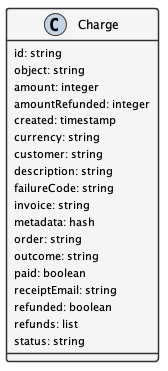

Membership Plan Management
==========================

.. contents:: Table of Contents
    :depth: 2

Overview
--------

To support ongoing operations, DataONE offers paid services for memberships. This document outlines the design and implementation details needed to offer these services. It describes the Products, Customers, Orders, Invoices, Charges, and Quotas that DataONE needs to track. This documents:

- What service Products are available for purchase
- What Products a Customer purchased in an Order
- What Invoices have been sent for an Order
- Which payment Charge(s) completed the Order
- What Quota limits are set for Customers per Product.

Details of how the payment will be collected is to be determined, but will involve the UCSB Aventri events service. Personally identifiable information that is stored will be limited to names, emails, and billing addresses, and will exclude financial transaction details (credit cards, etc.) other than the outcome of a Charge transaction.

The following diagram shows the membership and payment records stored by DataONE and their relationships.

..
    @startuml images/overview.png
    !include ./plantuml-styles.txt
    class Product {
    }
    class Customer {
    }
    class Order {
    }
    class Invoice {
    }
    class Charge {
    }
    class Quota {
    }
    
    Customer "1" --o "n" Order : "   associated with"
    Order "0" -right-o "n" Product : "associated with"
    Order "0" -up-o "n" Charge : "   associated with"
    Order "1" -left-o "n" Invoice : "   associated with"
    Customer "0"-right-o "n" Quota : "   associated with"
    Product "0"-down-o "n" Quota : "   associated with"
    
    @enduml
    
.. image:: images/overview.png

Products
--------

Products define the exact DataONE service offered, and describe the features of the service using the extensible ``metadata`` field.  Each Product is unique and may be part of any Order, such as training or consultation Products.  DataONE keeps a catalog of Products offered over time which may be listed by client applications.

..
    @startuml images/product.png
    !include ./plantuml-styles.txt

    class Product {
        id: string
        object: string
        active: boolean
        name: string
        caption: string
        description: string
        created: timestamp
        statementDescriptor: string
        type: string
        unitLabel: string
        url: string
        metadata: hash
        quotas: list
    }
    @enduml

.. image:: images/product.png

An example Product:

.. code:: json

    {
        "id": "725C2F79-7E0B-4018-94F3-C16D05F23CCC",
        "object": "product",
        "active": true,
        "name": "Organization",
        "caption": "Small institutions or groups",
        "description": "Create multiple portals for your work and projects. Help others understand and access your data.",
        "created": 1559768309,
        "statementDescriptor": "DataONE Membership Plan - Organization",
        "type": "service",
        "unitLabel": "membership",
        "url": "https://dataone.org/memberships/organization",
        "metadata": {
            "features": [
                {
                    "name": "custom_portal",
                    "label": "Branded Portals",
                    "description": "Showcase your research, data, results, and usage metrics by building a custom web portal.",
                    "quota": {
                        "object": "quota"
                        "name": "custom_portal_count"
                        "softLimit": "3"
                        "hardLimit": "3"
                        "unit": "portal"
                    }
                },
                {
                    "name": "custom_search_filters",
                    "label": "Custom Search Filters",
                    "description": "Create custom search filters in your portal to allow scientists to search your holdings using filters appropriate to your field of science."
                },
                {
                    "name": "fair_data_assessment",
                    "label": "FAIR Data Assessments",
                    "description": "Access quality metric reports using the FAIR data suite of checks."
                },
                {
                    "name": "custom_quality_service",
                    "label": "Custom Quality Metrics",
                    "description": "Create a suite of custom quality metadata checks specific to your datasets."
                },
                {
                    "name": "aggregated_metrics",
                    "label": "Aggregated Metrics",
                    "description": "Access and share reports on aggregated usage metrics such as dataset views, data downloads, and dataset citations."
                },
                {
                    "name": "dataone_voting_member",
                    "label": "DataONE Voting Member",
                    "description": "Vote on the direction and priorities at DataONE Community meetings."
                }
            ]
        }
    }

Customers
---------

Customers are associated with a DataONE account (by ORCID), and are associated with Orders, Invoices, Charges, and Quotas based on certain free or purchased Products.
 
..
    @startuml images/customer.png
    !include ./plantuml-styles.txt

    class Customer {
        id: string
        object: string
        balance: integer
        address: hash
        created: timestamp
        currency: string
        delinquent: boolean
        description: string
        discount: hash
        email: string
        invoicePrefix: string
        invoiceSettings: hash
        metadata: hashes
        name: string
        phone: string
        subscriptions: list
        taxExempt: string
    }
    @enduml

.. image:: images/customer.png

Quotas
------

Quotas are limits set for a particular product, such as the number of portals allowed, disk space allowed, etc. Quotas have a soft and hard limit per unit to help with communicating limit warnings.  Quotas that are not associated with a ``Subject`` are considered general product quotas used for informational display (part of a Product's Feature list).

Quotas kept for individual ``Subject`` identifiers also include a ``usage`` field that is periodically updated to reflect the ``Subject``'s current usage of the resource, harvested from the Coordinating Node indices.  

.. note::
    
    The usage harvest schedule is to be determined, but calculating usage once per hour or once per day may be appropriate.

..
    @startuml images/quota.png
    !include ./plantuml-styles.txt

    class Quota {
        id: string
        object: string
        name: string
        softLimit: integer
        hardLimit: integer
        usage: integer
        unit: string
        customerId: integer,
        subject: string
    }
    @enduml

.. image:: images/quota.png

.. note::
    Quota limits and usages are typed as integers (32 bit) and not longs (64 bit) because of issues related to duck-typing text-based JSON values while unmarshalling quotas.  For this reason, storage quotas are expressed in a unit such as ``megabyte`` so that the stored number is below the max integer (2^31 -1).
    
Authorizing resource usage
~~~~~~~~~~~~~~~~~~~~~~~~~~
    
Authorization of resource usage across Member Nodes involves a call to the quota service to determine the soft limit, hard limit, and usage, and throwing an InsufficentResources exception when the usage is at or over the hard limit.  For storage quotas, hard limits might be set to 10% greater than the soft limit, whereas for portal limits, the soft and hard limits might be equal.  These settings can be individually customized as well. Client applications may also check quota limits for a given ``Subject`` before attempting to call an ``MNStorage`` API method (i.e. ``create()`` or ``update``).
    
Managing Shared Quotas
~~~~~~~~~~~~~~~~~~~~~~

Quotas are established when a Customer enrolls for free or paid services.  Customers are associated with their ``Subject`` identifier (e.g. their ORCID identifier), and quotas are set against their this identifier.  When objects are uploaded to DataONE Member Nodes, the ``SystemMetadata.rightsHolder`` field is used to check for quota limits.  In the case of an individual researcher, the client application should set the rightsHolder to the individual's ``Subject`` identifier.

In the case of shared quotas where a resource (like storage) is to be applied to a group of users,
client applications should set the ``rightsHolder`` field for each object to the DataONE group identifier associated with the shared quota (e.g. ``CN=budden-lab,DC=dataone,DC=org``).  The "owner" of the object (i.e. the ``rightsHolder``) is then used to determine quota usage across the DataONE network.

.. note::
    Using the ``SystemMetadata.rightsHolder`` field is a simple way to definitively manage quotas for both users and groups, but also has implications on authorization.  This needs discussion.

Orders
------

Orders track Customer purchases of a list of Products, and the total amount of the Order that was charged in a Charge.

..
    @startuml images/order.png
    !include ./plantuml-styles.txt

    class Order {
        id: string
        object: string
        amount: integer
        amountReturned: integer
        charge: string
        created: timestamp
        currency: string
        customer: string
        email: string
        items: array of hashes
        metadata: hash
        status: string
        statusTransitions: hash
        updated: timestamp
    }
    @enduml

.. image:: images/order.png

Charges
-------

Charges document transactions against a given payment source, like a credit card.  While DataONE won't track payment sources, we will track Charge events by ID as part of an Order.

..
    @startuml images/charge.png
    !include ./plantuml-styles.txt

    class Charge {
        id: string
        object: string
        amount: integer
        amountRefunded: integer
        created: timestamp
        currency: string
        customer: string
        description: string
        failureCode: string
        invoice: string
        metadata: hash
        order: string
        outcome: string
        paid: boolean
        receiptEmail: string
        refunded: boolean
        refunds: list
        status: string
    }
    @enduml

